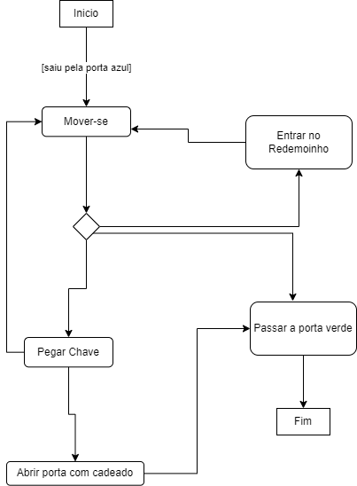

# Jogo: **Atrás da Porta Verde**

## Súmario executivo

### Descrição do Sistema
Jogo de `tabuleiro`. Um `jogador`. Um objetivo. Duas maneiras de chegar ao objetivo. O objetivo é chegar até a `porta de saída` (Porta Verde). O Jogo é composto por `obstáculos` e `portais`. `O personagem não pode se movimentar para frente`. O tabuleiro é disposto verticalmente em quadrantes - tamanho 6x5. O jogador se move com comandos pré estabelecidos. Ele inicia o jogo na posição linha 1, quadrado 3 (l1,q3), virado para frente do tabuleiro. Há uma `porta de entrada` (Porta Azul) e uma porta de saída. Para alcançar o objetivo o jogador pode ir até a porta verde ou tentar alcançar a `chave` e abrir a `porta com cadeado`. 

---
### Atores
- Jogador

### Objetos/Componentes
- Porta Azul (Entrada)
- Porta Verde (Saída)
- Porta com cadeado
- Chave
### Obstáculos
- Barris
- Cercas
### Portais
- Redemoinhos
---
## Diagrama de Atividades

```mermaid
flowchart TB
    A((Inicio))
    B(Mover-se)
    C{fa:fa-blank}
    D(Pegar Chave)
    E(Abrir Porta com Cadeado)
    F(Entrar no Redemoinho)
    G(Passar a Porta Verde)
    H((Fim))
    A ---> |saiu pela porta azul|B ----- C ---- D ---- E ---- G ---- H
    F ---- B & G
    C -----> F & G
    style A fill:#FFFFFF,stroke:#000000
    style B fill:#FFFFFF,stroke:#000000
    style C fill:#000000,stroke:#000000
    style D fill:#FFFFFF,stroke:#000000
    style E fill:#FFFFFF,stroke:#000000
    style F fill:#FFFFFF,stroke:#000000
    style G fill:#FFFFFF,stroke:#000000
    style H fill:#FFFFFF,stroke:#000000
```

## Diagrama de Estado

```mermaid
flowchart LR
A(((fa:fa-blank))) ----|começou o jogo| B(Explorando) ----|encontou saída| D(((fa:fa-t))); B ------- |andou para frente| A

style A fill:#000000,stroke:#000000
style B fill:#FFFFFF,stroke:#000000
style D fill:#000000,stroke:#FFFFFF,stroke-width:3.5
```

---

   

    

