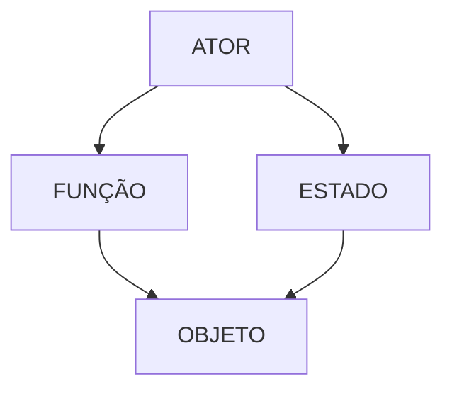
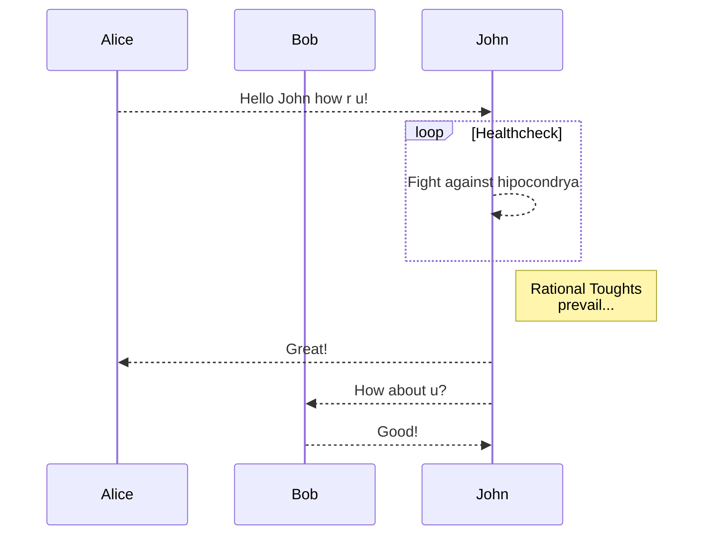

# Análise

- Definir o que é o sistema
    - o que pertence ao sistema
    - do que é feito 
    - quais as partes

- Atores
    - Quem atua sobre o sistema?
    - Quem é ativo no sistema (faz coisas)
    - Não precisam ser só pessoas
    - É importante definir a classe deles (que tipo de ator é esse)
    -  Demias objetos/partes que compõem o sistema
        - Classificar também as partes (dar nomes aos tipos)

---

