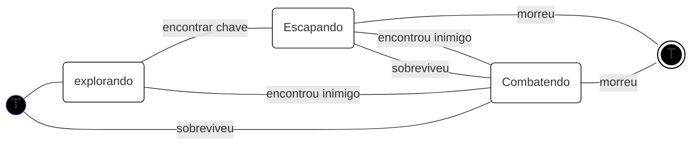

# Estados
## Exemplo:

```mermaid
flowchart LR
A((fa:fa-t)) --- B(explorando)
B ---|encontrar chave| C(Escapando)
B ---|encontrou inimigo| D(Combatendo)
D ---|sobreviveu|A
C & D ---|morreu| E(((fa:fa-t)))
D ---|sobreviveu| C
C ---|encontrou inimigo|D
style A fill:#000000
style B fill:#FFFFFF,stroke:#000000,stroke-width:1px
style C fill:#FFFFFF,stroke:#000000
style D fill:#FFFFFF,stroke:#000000
style E fill:#000000,stroke:#FFFFFF,stroke-width:3.5
```
----
