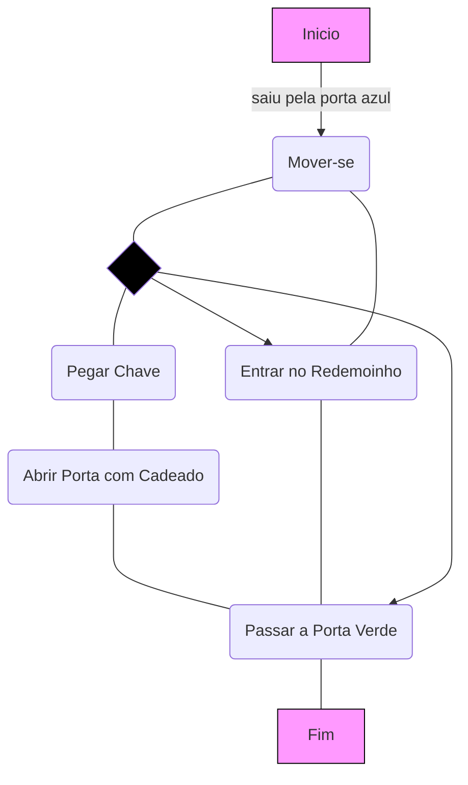
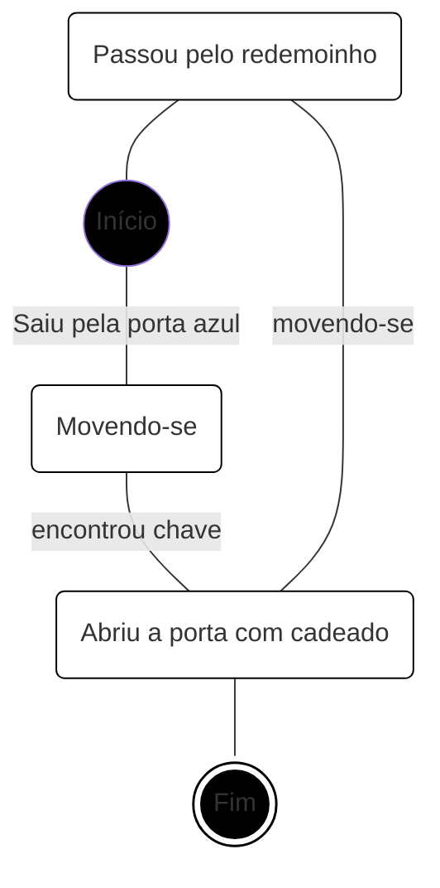

```mermaid
flowchart TB
    A[Inicio]
    B(Mover-se)
    C{fa:fa-blank}
    D(Pegar Chave)
    E(Abrir Porta com Cadeado)
    F(Entrar no Redemoinho)
    G(Passar a Porta Verde)
    H[Fim]
    A --> |saiu pela porta azul|B --- C --- D --- E ---- G --- H
    F --- B & G
    C --> F & G
    style A fill:#f9f,stroke:#000000,stroke-width:1px
    style H fill:#f9f,stroke:#000000,stroke-width:1px
    style C fill:#000000
```
-------

```mermaid
flowchart TB
A((Início)) ---|Saiu pela porta azul| B(Movendo-se)
B ---|encontrou chave| C(Abriu a porta com cadeado) --- E
D(Passou pelo redemoinho) ---A
E(((Fim)))
D ---|movendo-se| C


style A fill:#000000
style B fill:#FFFFFF,stroke:#000000,stroke-width:1px
style C fill:#FFFFFF,stroke:#000000
style D fill:#FFFFFF,stroke:#000000
style E fill:#000000,stroke:#FFFFFF,stroke-width:3.5
```
----