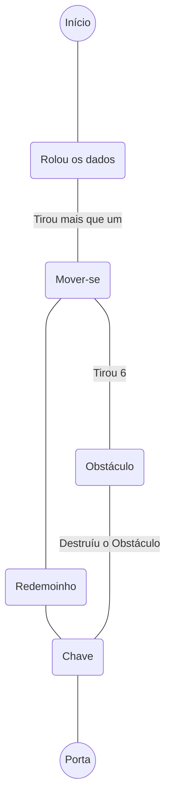

O jogo inicia em um Tabuleiro com dimesão 7x5, sendo dividido em duas partes por obstáculos. O jogo 

# Jogo
Jogo de `Tabuleiro 7x5`. `Um Jogador`. O objetivo é encontrar a `chave` e abrir a `porta`. O jogador inicia o jogo rolando um `dado de seis faces`. Sempre que ele precisar se movimentar, terá que rolar os dados novamente para definir quantos movimentos poderá fazer no tabuleiro. A passagem entre a porta e a chave está bloqueada por `obstáculos`, para atravessar é preciso entrar em um dos `portais` - o `vermelho` leva até a parte inferior, o `azul`, ou obter o número 6 no dado, em duas tentativas e destruir um dos obstáculos (é obrigatório estar em uma casa adjacente ao obstáculo e virado de frente para o mesmo.) Qualquer outra ação é ativada quando o jogador está em uma casa adjacente ao objetivo.

---

## Diagrama de Atividades

